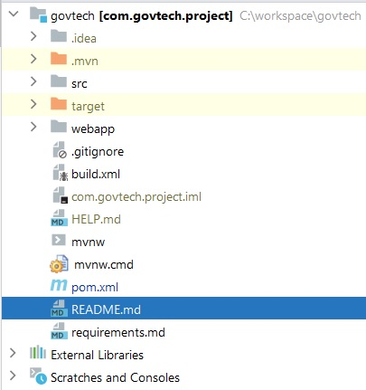

## GovTech Mini Project

#### Introduction

Govtech mini project assignment for opportunity.

Please refer the project requirements from
[here](doc/requirements.md)

#### Project Details 


| Project             | Details             |
---------------------|---------------------|
| Project Initiator   | **GovTech**         |
| Submission By       | **Selvaraj Ramesh** |
| Created Date        | January 17, 2024    |
| Submission Date     | January 25, 2024    |
| Submission Contact  | +65 97781207        |
| Project Approved By | GovTech             |

#### Revision History

| Date         | Version | Description | Author          |
---------------|---------|-------------|-----------------|
| Jan 14, 2014 | 0.1.0   | GovTech     | Selvaraj Ramesh |


#### GovTech Project Architecture

GovTech mini project divide into three major division.

1. Backend (Service & Database)
2. View (Web)
3. API (Application Programming Interface)

#### Backend

GovTech mini project backend splitted as three major parts.

1. Database (Storage)
2. Transaction (Repository)
3. Front Controller (Servlet, Filter, Security, Session)

**Dependency**

* H2 Database - 2.2.224
* SpringBoot - 3.2.1
* jackson - 2.15.3
* jakarta persistence API - 3.1.0
* tomcat embed - 10.1.17
* Hibernate Implementation - 6.4.1
* HikariCP Connection Pool - 5.0.1


#### View (Web)

GovTech web client is a client-side application used for connecting to a web server over HTTP. Web pages received from the server and allows users to interact with the web server. web pages using client side rendering.

**Dependency**

* React - 18.2.0
* Javascript ES6

#### API

GovTech API - Application programming interface connected with JSON format.

#### Limitations

* Dependency is open source, No vendor technical and upgrade support. 

#### Road Map

- GovTech application security release planned for 0.2.0.
The technical requirements is oauth 2.0 jwt bearer flow


### Sprint Project Management

#### Sprint 1

1. Install required tools and package to develop applications
2. Create application structure with backend directory
3. Create web page static, src and other package structures
4. Generate build, and deploy scripts

#### Sprint 2

1. Database H2  & Hibernate configuration updated
2. Database table JPA required entity created
3. Create Dao and JPA classes to communicate with database
4. Business logic, data validation parts are going on service layer
5. Web client react router page navigation is created 

#### Sprint 3    

1. Service API functionality update
2. Data fetched from web client
3. Validation need to be done for server & client side.
3. Make sure all required service & web client worked well

#### Sprint 4

1. Create functional test for web client
2. Create functional test for web server
3. SIT test should be passed 

#### Sprint 5

1. Create technical, api, and user documents
2. Deploy the application at UAT if the test is passed release as well as at production.


### Deploy application from the source

Pre request to deploy the application

1. Java 17 
2. Git version control
3. Maven dependency management
4. Node.js for react web client

The application source is divided by two parts

1. Spring boot server
2. React npm development

**Spring boot server**

Download the resources from url https://github.com/srameshfriends/govtech

bin directory the executable jar using the following command will run the application

```
java -jar com.govtech.project-0.1.0.jar
```

CLI using the following command




```
git clone https://github.com/srameshfriends/govtech.git
cd govtech
```

To build web application

```
cd webapp
npm install
npm run build
```

Now react build files created at **webapp/build** package

Run apache ant build.xml file to copy the resource to relative path of web service **public** folder.

```
~/src/main/resources/public
```

Now maven package help to create executed jar bundle to run application. 

move to project pom.xml directory using CLI terminal.

```
mvn clean package 
```

successful package at 

```
target\com.govtech.project-0.1.0.jar
```

To run the application with the command

```
cd target
java -jar com.govtech.project-0.1.0.jar
```


